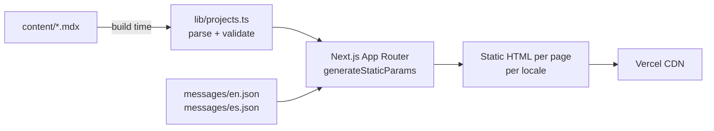
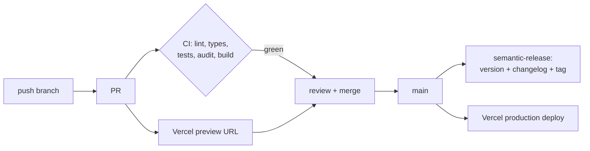

# Architecture

## Rendering model: SSG

Everything is generated at build time. There is no server logic in v1.

## Content pipeline

One MDX file per project **per locale**: `content/projects/<slug>.<locale>.mdx`.
`lib/projects.ts` validates frontmatter at build time — invalid content fails
the build (and therefore CI), so broken content can never reach production.

## i18n

next-intl with locale-prefixed routes (`/en/...`, `/es/...`), default `en`.
UI strings in `messages/`; long-form content in MDX per locale.

## Delivery pipeline

